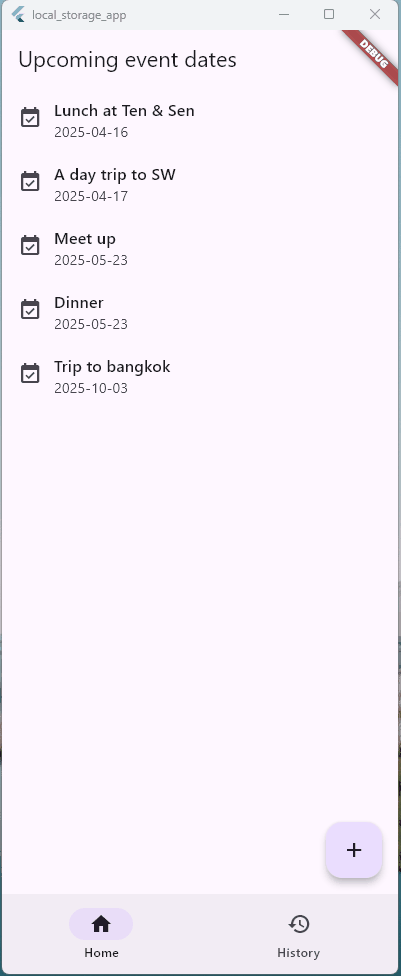

# Flutter: Local storage demo app using Drift


This is a Flutter project that demonstorates how to store user data on a local device. This project was extended from the [previous one](https://github.com/ChiekoN/Flutter-bloc_state_app).

In my previous project, any change the user added/deleted on the date list was only alive within a run, and it was all gone when the app finished. However, in real-world apps, those data should be retained and be accessible in the next run. 

In this project, I implemented local storage to persist the user's latest edit to a device. Now, when I stop the app and then restart, the changes I made in the previous session is still valid, as the following GIF shows.

<br/>



## Local Storage options in Flutter

Flutter has some options for local storage.

 - **shared_preference:** Lightweight key-value storage. It's a Flutter plugin ([official doc](https://docs.flutter.dev/cookbook/persistence/key-value))
 - **Using `File` class and `path_provider` package:** Writing data into files in local storage ([official doc](https://docs.flutter.dev/cookbook/persistence/reading-writing-files))
 - **sqflite:** SQLite implementation for Flutter ([doc](https://pub.dev/packages/sqflite))
 - **Hive:** Lightweight and buzzing-fast key-value database for Flutter and Dart ([doc](https://github.com/isar/hive))
 - **Isar:** Super fast cross-platform database for Flutter ([doc](https://isar.dev/))
 - **Drift:** Type-safe reactive persistence library for Flutter built on top of SQLite ([doc](https://drift.simonbinder.eu/))
 - **ObjectBox:** NoSQL, object-oriented database with excellent performance ([doc](https://pub.dev/packages/objectbox))


**shared_preference** will be sufficient for small data and could be the first choice. But considering versatility and scalability in the future, I decided to explore a database package here.

Then, I thought of **Hive** because it seemed fast and lightweight as well as simple to use. However, I encountered some discussion on the internet and I noticed Hive hadn't been maintained for some time. After seeking alternatives, I decided to try **Drift** here. Drift could be a bit complicated for beginners like me to understand (actually I felt so), but *Type safety* and availability of *Stream queries* (I don't use this feature in this project, though) are valuable features if they are at hand.
 

## Code

```
lib
 ┣ data  // represents data layer
 ┃ ┣ models
 ┃ ┃ ┣ data_todate.dart  // Drift database model
 ┃ ┃ ┗ data_todate.g.dart  // Autogenerated by Drift
 ┃ ┗ repository
 ┃ ┃ ┗ data_todate_repo.dart  // implementation of data repository
 ┣ domain  // represents domain layer
 ┃ ┣ models
 ┃ ┃ ┗ todate.dart
 ┃ ┗ repository
 ┃ ┃ ┗ todate_repo.dart
 ┣ feature  // represents feature/UI layer
 ┃ ┣ pages
 ┃ ┃ ┣ add
 ┃ ┃ ┃ ┗ add.dart
 ┃ ┃ ┣ detail
 ┃ ┃ ┃ ┣ date_area.dart
 ┃ ┃ ┃ ┣ detail.dart
 ┃ ┃ ┃ ┣ history_detail.dart
 ┃ ┃ ┃ ┗ memo_area.dart
 ┃ ┃ ┣ history
 ┃ ┃ ┃ ┗ history.dart
 ┃ ┃ ┗ toplist
 ┃ ┃ ┃ ┗ toplist.dart
 ┃ ┗ shared
 ┃ ┃ ┣ app.dart
 ┃ ┃ ┣ bottom_navbar.dart
 ┃ ┃ ┣ router.dart
 ┃ ┃ ┣ todate_cubit.dart
 ┃ ┃ ┣ todate_provider.dart
 ┃ ┃ ┗ todate_rootview.dart
 ┗ main.dart
```


## Platform

In develpment, I selected Windows app as my target device.


## Flutter resources

A few resources to get you started if this is your first Flutter project:

- [Lab: Write your first Flutter app](https://docs.flutter.dev/get-started/codelab)
- [Cookbook: Useful Flutter samples](https://docs.flutter.dev/cookbook)

For help getting started with Flutter development, view the
[online documentation](https://docs.flutter.dev/), which offers tutorials,
samples, guidance on mobile development, and a full API reference.
